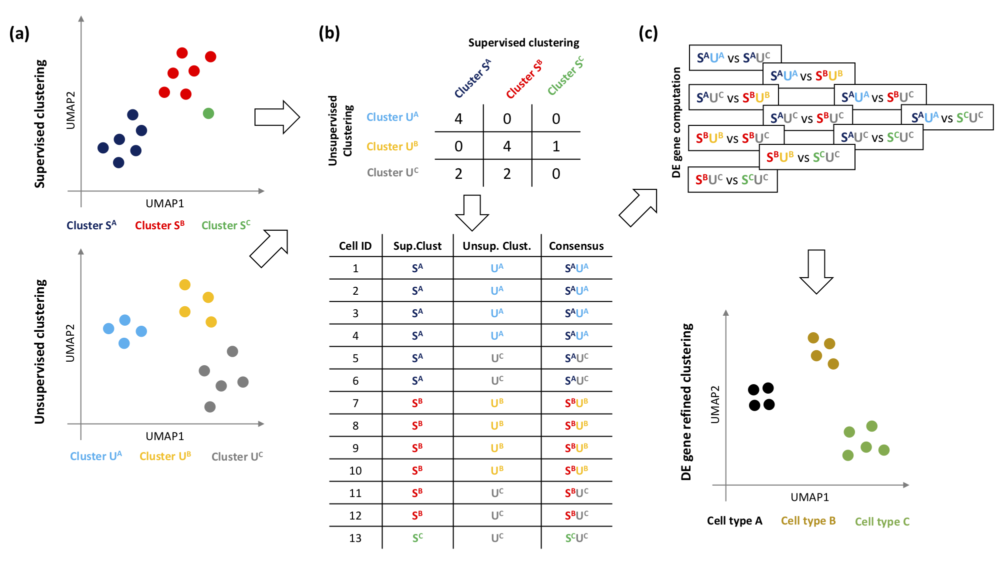
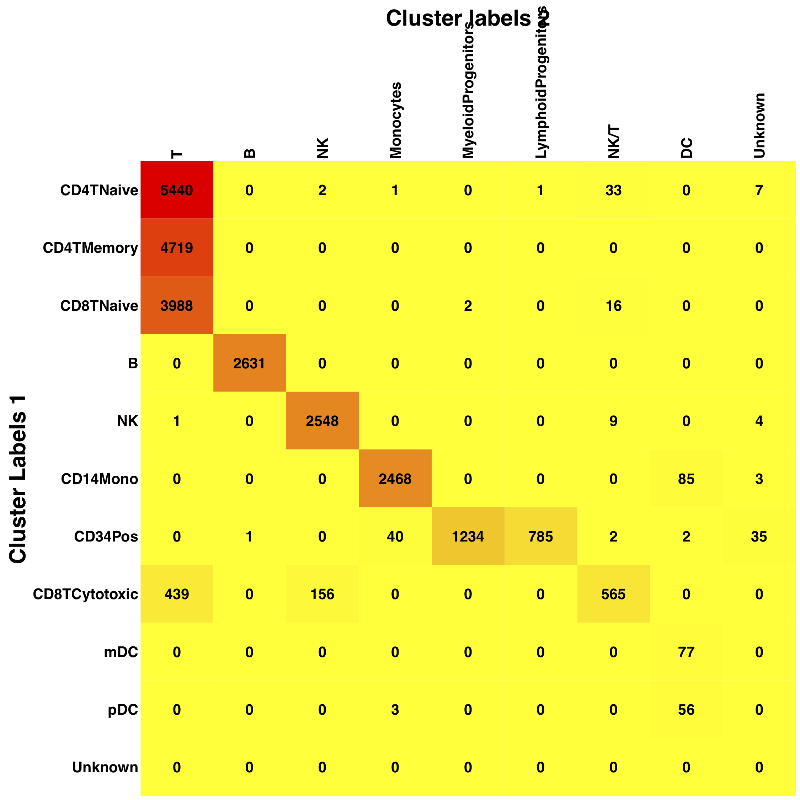
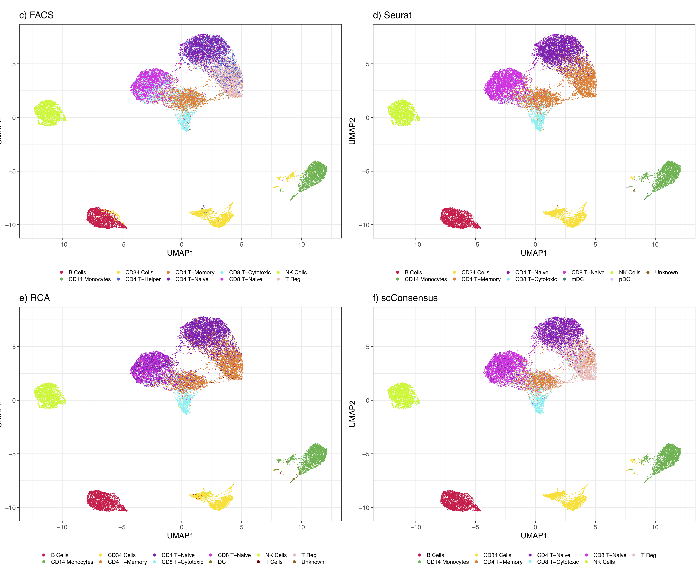

# scConsensus
An approach combining semi-supervised and unsupervised clustering for cell type annotation in single-cell RNA-seq data



**Overview of scConsensus**: (a) The scConsensus workflow considers two independent cell cluster annotations obtained from any pair of supervised and unsupervised clustering methods. (b) A contingency table is generated to elucidate the overlap of the annotations on the single cell level. A consensus labeling is generated using either an automated method or manual curation by the user. (c) DE genes are computed between all pairs of consensus clusters. Those DE genes are used to re-cluster the data. The refined clusters thus obtained can be annotated with cell type labels.

## Installing scConsensus

```R
devtools::install_github("prabhakarlab/scConsensus")
```

scConsensus imports the following R packages:


* BiocManager 
* edgeR
* WGCNA
* GO.db
* AnnotationDbi
* preprocessCore
* mclust
* ComplexHeatmap
* circlize
* reshape2
* flashClust
* calibrate
* dynamicTreeCut
* irlba

The data used in the manuscript is deposited [here](https://zenodo.org/record/3637700#.Xjpf3hMzY1J)

## Example on 26k FACS-sorted PBMC data from Zheng et al. 2017

We ran Seurat and RCA on 26k FACS-sorted PBMCs from [Zheng et al. 2017](https://www.nature.com/articles/ncomms14049). The Seurat and RCA results are used as input for scConsensus. These objects are available [here](https://zenodo.org/record/3637700#.Xjpf3hMzY1J) - download the *pbmc_26k_S.v3.Filtered.rds* and *pbmc_26k_rca_obj.rds* files.

```R
# Load the Seurat and RCA objects...
seuratObj <- readRDS("pbmc_26k_S.v3.Filtered.rds")
rca2Obj <- readRDS("pbmc_26k_rca_obj.rds")


# Assigning cell type names to Seurat clusters
seurat_numbers <- as.character(seuratObj$RNA_snn_res.0.2)
names(seurat_numbers) <- colnames(seuratObj)
unique_seurat_numbers <- as.character(sort(as.numeric(unique(seurat_numbers))))
names(unique_seurat_numbers) <- c("CD4_T-Memory", "CD4_T-Naive", "CD8_T-Naive", "B_Cells", "NK_Cells", "CD14_Monocytes", "CD34_Cells", "CD8_T-Cytotoxic", "CD34_Cells", "mDC", "pDC", "Unknown")
seurat_celltypes <- c()
for(num in unique_seurat_numbers) {
    seurat_celltypes[which(seurat_numbers == num)] <- names(which(unique_seurat_numbers == num))
}

# Assigning cell type names to RCA clusters
rca_colors <- rca2Obj$clustering.out$dynamicColorsList$`deepSplit 1`
rca_colors_ds4 <- rca2Obj$clustering.out$dynamicColorsList$`deepSplit 4`
names(rca_colors_ds4) <- colnames(seuratObj)

unique_rca_colors <- unique(rca_colors)
unique_rca_celltypes <- c("red" = "CD8_T-Cytotoxic", "blue" = "NK_Cells", "black" = "DC", "turquoise" = "T_Cells", "pink" = "NK_Cells", "yellow" = "CD14_Monocytes", "magenta" = "B_Cells", "green" = "CD34_Cells", "brown" = "B_Cells")

rca_celltypes <- c()
for(color in unique_rca_colors) {
    rca_celltypes[which(rca_colors == color)] <- unique_rca_celltypes[color]
}

names(rca_celltypes) <- colnames(seuratObj)

rca_celltypes[names(rca_colors_ds4)[which(rca_colors_ds4 == "salmon")]] <- "CD8_T-Cytotoxic"
rca_celltypes[names(rca_colors_ds4)[which(rca_colors_ds4 == "royalblue")]] <- "T_Reg"
rca_celltypes[names(rca_colors_ds4)[which(rca_colors_ds4 %in% c("white", "cyan", "darkred", "green"))]] <- "CD8_T-Naive"
rca_celltypes[names(rca_colors_ds4)[which(rca_colors_ds4 %in% c("purple", "lightcyan", "blue", "violet", "lightyellow"))]] <- "CD4_T-Helper"
rca_celltypes[names(rca_colors_ds4)[which(rca_colors_ds4 == "turquoise")]] <- "CD4_T-Naive"
rca_celltypes[names(rca_colors_ds4)[which(rca_colors_ds4 %in% c("darkmagenta", "lightsteelblue1", "darkgreen", "darkturquoise"))]] <- "CD34_Cells"
rca_celltypes[which(is.na(rca_celltypes))] <- "Unknown"

```

### Obtaining the consensus cluster labels

Using the Seurat and RCA cell type labels, we plot a contingency table using the `plotContingencyTable` function:

```R
# Plot the contingency table
scRes <- plotContingencyTable(cluster_labels_1 = seurat_celltypes, cluster_labels_2 = rca_celltypes, filename = "Contingency_Table.pdf")
```

For this dataset, we manually consolidated the 2 clustering outputs to obtain a consensus set of cluster labels in the following manner:

```R
# Get consensus cluster labels
names(seurat_celltypes) <- colnames(seuratObj)

consensusClusterLabels <- seurat_celltypes

consensusClusterLabels[names(which(seurat_celltypes == "pDC" & rca_celltypes == "CD34_Cells"))] <- "CD34_Cells"
consensusClusterLabels[names(which(seurat_celltypes == "CD34_Cells" & rca_celltypes == "DC"))] <- "CD34_Cells"

consensusClusterLabels[names(which(rca_celltypes == "T_Reg"))] <- "T_Reg"
 
consensusClusterLabels <- consensusClusterLabels[colnames(seuratObj)]

```



**Contingency Table**: Consensus matrix of cell type  annotation for PBMC data.Columns show  cell type labels based on supervised clustering with RCA, rows show cell type labels based on unsupervised clusters using Seurat and a subsequent marker based annotation. The most informative labelling could be obtained by combining both annotations, e.g. the immune cell annotation derived from Seurat clustering and the Progenitor annotation derived by RCA.

### DE Gene Refinement of Cluster Labels

After obtaining the consensus cluster labels, we further refine this clustering by selecting the top DE genes between every pair of clusters, after filtering out genes that were lowly expressed.

```R
seurat.data <- seuratObj@assays$RNA@data

seurat.data <- seurat.data[rowSums(seurat.data>0)>100, ]

deObj <- reclusterDEConsensus(dataMatrix = seurat.data, consensusClusterLabels = consensusClusterLabels, method = "edgeR", qValThrs = 0.01, fcThrs = 2, meanScalingFactor = 2, deepSplitValues = 1:4, minClusterSize = 10, filename = "Reclustered_DE_edgeR.rds", plotName = "Reclustered_DE_edgeR_Heatmap.pdf")
```

**DE Gene Heatmap with Cluster Labels**: The black and white rows indicate the consensus cluster labels that were used to call DE genes, while the color bars indicate the different depths of hierarchical clusters that were obtained by reclustering the cells using these DE genes.

We then annotated the resulting cluster labels by assigning cell type names to clusters based on the DE heatmap

```R
# Annotate DE gene clusters
de_colors <- deObj$dynamicColors$`deepsplit: 3`

# de_colors_ds_4 <- pca_dynamicColorsList$`deepsplit: 4`
# names(de_colors_ds_4) <- colnames(seurat.data)

unique_de_colors <- c("CD14_Monocytes" = "midnightblue", "CD14_Monocytes" = "magenta", "CD14_Monocytes" = "lightgreen", "CD14_Monocytes" = "darkgreen", "CD34_Cells" = "darkred", "B_Cells" = "grey60", "B_Cells" = "yellow", "CD34_Cells" = "purple", "CD34_Cells" = "royalblue", "CD34_Cells" = "lightcyan", "NK_Cells" = "pink", "NK_Cells" = "greenyellow", "CD8_T-Naive" = "blue", "CD8_T-Naive" = "red", "CD4_T-Naive" = "green", "T_Reg" = "salmon", "CD4_T-Naive" = "brown", "CD8_T-Cytotoxic" = "lightyellow", "CD8_T-Cytotoxic" = "tan", "T_Reg" = "cyan", "CD4_T-Memory" = "turquoise", "T_Reg" = "black")

de_celltypes <- c()
for(i in seq_along(unique_de_colors)) {
    de_celltypes[which(de_colors == unique_de_colors[i])] <- names(unique_de_colors)[i]
}
names(de_celltypes) <- colnames(seurat.data)
```

### Visualizing the results in a UMAP (not part of scConsensus)

To visualize these cells as a UMAP, we computed the top 30 upregulated genes in each FACS-labelled cell type and used these DE genes as features for an unbiased feature space.

```R
Idents(seuratObj) <- "orig.ident"

facs.de.markers <- FindAllMarkers(object = seuratObj, min.pct = 0.75, logfc.threshold = 0.25, only.pos = T)

top30.facs.de.markers <- facs.de.markers %>% group_by(cluster) %>% top_n(n = 30, wt = avg_logFC)

pca.obj <- irlba::prcomp_irlba(x = t(seurat.data[unique(top30.facs.de.markers$gene),]), n = 15, center = TRUE, scale. = FALSE)
pca.data <- pca.obj$x[, 1:8]

umap.data <- umap::umap(d = pca.data)
umap.df <- as.data.frame(umap.data$layout)
colnames(umap.df) <- c("UMAP1", "UMAP2")
umap.df$scConsensus <- de_celltypes
umap.df$FACS_Labels <- facs_celltypes
umap.df$Seurat <- seurat_facs_matched_celltypes
umap.df$RCA <- rca_facs_matched_celltypes
```


**UMAP visualization**: PBMCs colored by Seurat, RCA and scConsensus as compared to the FACS labels.
